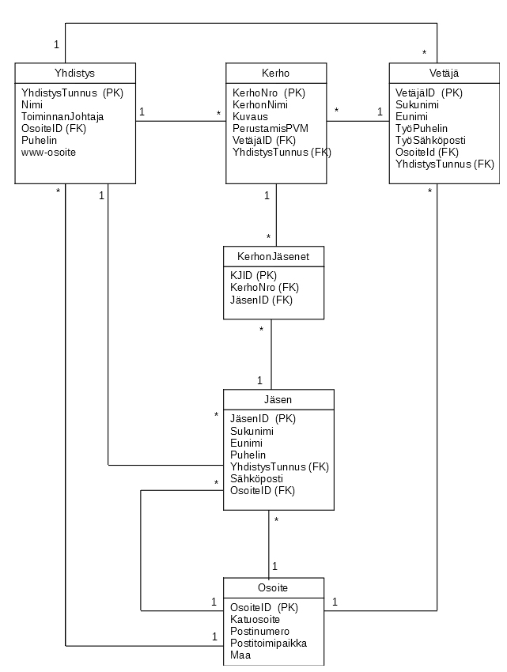

# Tehtävä 03:

- Tietokannan ulkoiset indeksit

Millaisia ulkoisia indeksejä loisit edellisen tehtävän 02 YhdistyksenTietokanta -nimiseen tietokantaan. Perustele omin sanoin.

Mitkä ovat ne syyt, miksi näitä ulkoisia indeksejä kannattaa luoda? Anna ainakin yhdestä ulkoisen indeksin luonnista sen luonti komento vastauksena.

 
Kuva 1. Yhdistyksen tietokannan relaatiokaavio.

Palauta tämän jälkeen Moodleen, palautuslinkkiin luomasi ulkoisten indeksien  luonti lauseet T-SQL kielisenä scriptinä (Transact-SQL).
