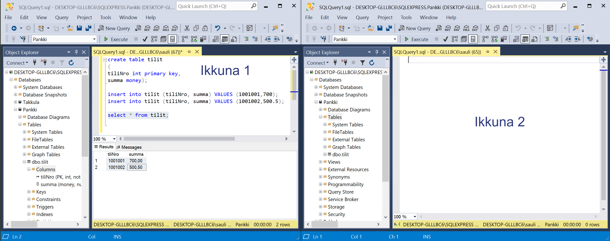
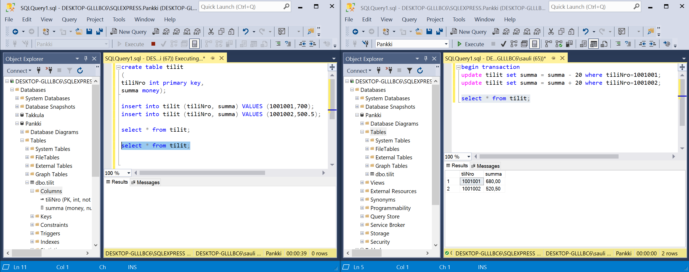
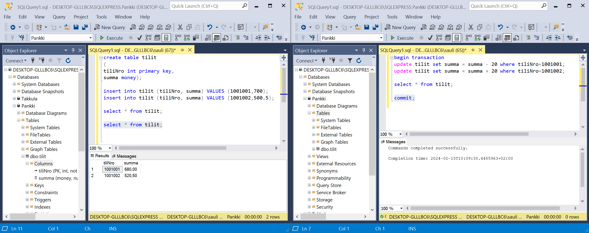

# Tehtävä 01:

- Kahden eri transaktion (esim. kahden eri käyttäjän tai ikkunan) kilpailutilanne samasta datarivistä tietokannassa.

- Tee seuraavanlainen tehtävä SQL Server:in Management Studiossa.
- Tee Pankki niminen tietokanta.
- Luo sinne tietokanta taulu, jonka nimi on tilit: 
<code>
create table tilit
(tiliNro int primary key,
summa money);
</code>
 
- Lisää sen jälkeen tilit tauluun muutama tili tieto tilinumerolle 1001001 ja 1001002:
 
<code>
insert into tilit (tiliNro, summa) VALUES (1001001,700);
insert into tilit (tiliNro, summa) VALUES (1001002,500.5);
</code>
 
- Varmistu, että rivien lisäämenen tauluun onnistui:
<code>
select * from tilit;
</code>
 
Tuloksena pitäisi tulla:
tiliNro summa 
1001001	700,00 
1001002	500,50 
 
- Seuraavaksi tehtävä jatku siten, että nykyisestä SQL Server Management Studion ikkunasta tulee "Ikkuna 1". Tämän lisäksi tarvitse avata "Ikkuna 2", joka on tavallaan jonkin toisen käyttäjän käyttämä transaktio.

 
Kuva 1. Kahden "käyttäjää" kahden ikkunan avulla. 

- Ikkunassa 1 on jo todettu, että taulun tilit kaksi datariviä näkyvät niin kuin pitääkin.

- Nyt siirrytään Ikkunaan 2.
- Ja siellä aloitetaan transaktio Transact SQL:n eli T-SQL:n komennolla begin transaction. Tällainen transaktio lopetetaan joko komennolla commit tai rollback, jos halutaan peruuttaa transaktio. 
- Aja Ikkuna 2:ssa seuraavat lauseet. Kyseessä on tilisiirto tai maksu pankin järjestelmissä. Nyt käytämme sitä mahdollisimman selkeänä esimerkkinä aloitetusta transaktiosta, ja mitä vaikutuksia sillä on.

<code>
begin transaction
update tilit set summa = summa - 20 where tiliNro=1001001;
update tilit set summa = summa + 20 where tiliNro=1001002;

select * from tilit;
</code>

- Siirry takaisin Ikkuna 1:een
<code>
select * from tilit;
</code>
 

 
Kuva 2. Kilpailutilanne, jossa Ikkuna 1 odottaa Ikkuna 2:ta. 

- Kerro omin sanoin tämän tehtävän vastauksessasi Moodleen, mitä tässä kohtaa tapahtuu. Miksi Ikkuna 1:een ei tule tulosta, mutta Ikkuna 2:een tulee?

- Siirry nyt seuraavaksi takaisin Ikkuna 2:een ja aja siellä commit lause, lopettaaksesi kesken eräisen transaktion siellä

 
<code>
commit;
</code>
 

 
Kuva 3. Loppu tilanne, jossa lukot vapautetaan. 

- Kerro lopuksi vastauksessasi Moodleen, miksi nyt Ikkuna 1 saa tuloksen pitkän odottelun jälkeen.

-Palauta tämän jälkeen Moodleen, palautuslinkkiin  T-SQL kielinen scripti (Transact-SQL), jolla saat aikaan kilpailutilanteen. Sekä omin sanoin esittämäsi vastaukset tapahtumien kulusta.
