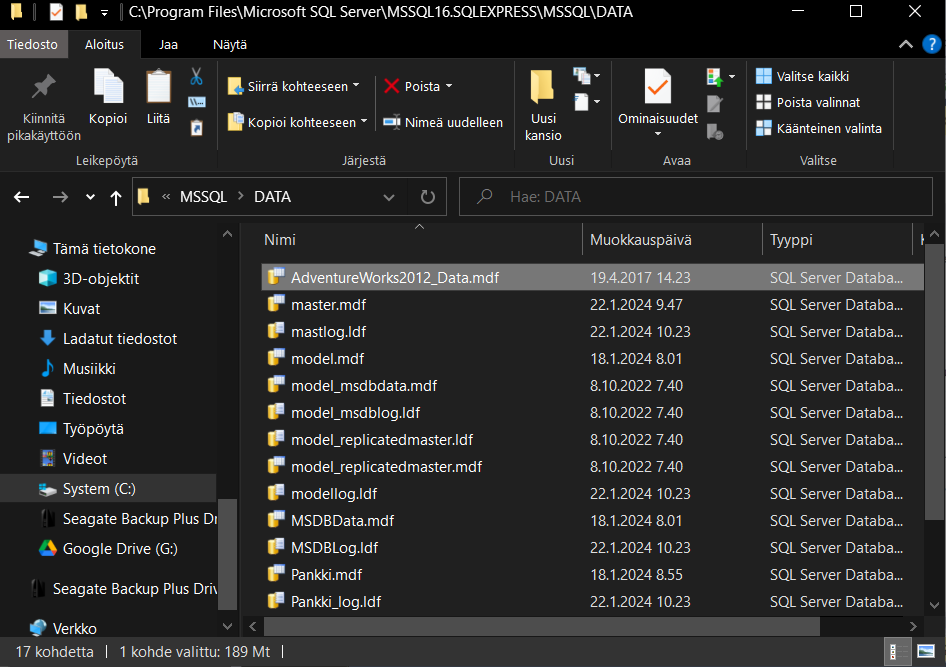
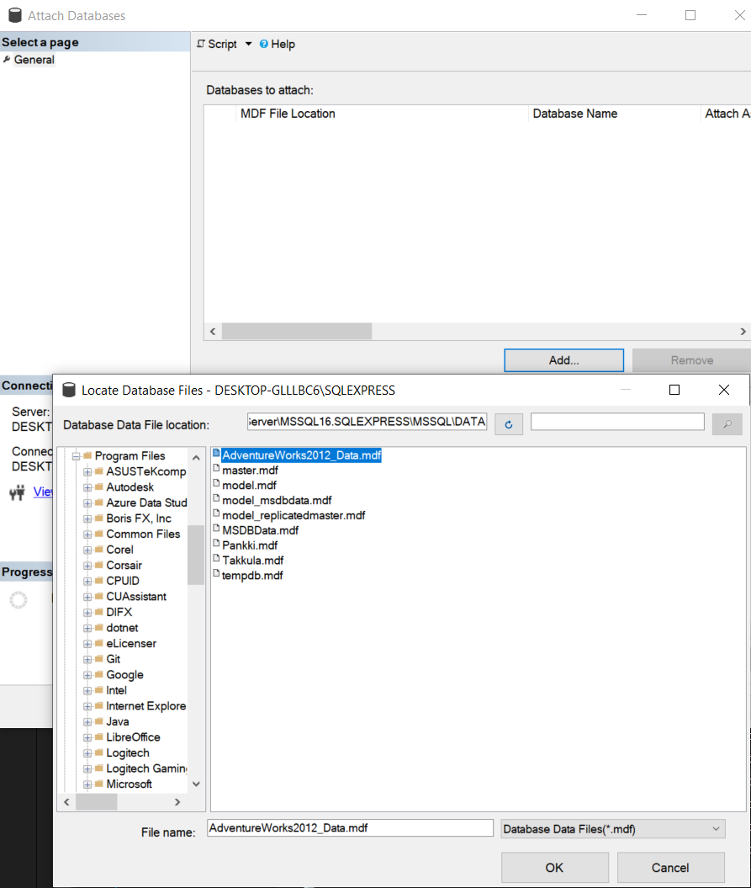
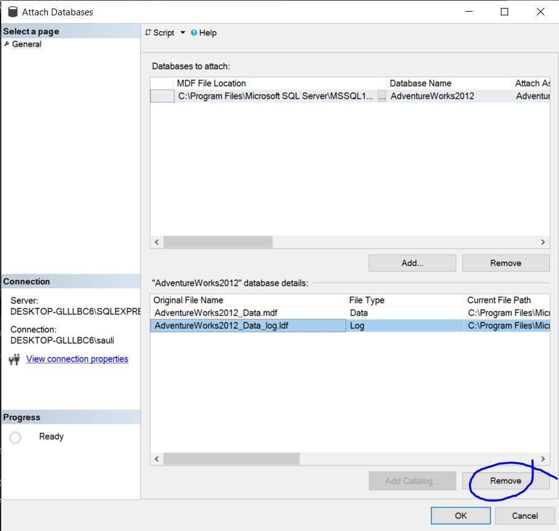
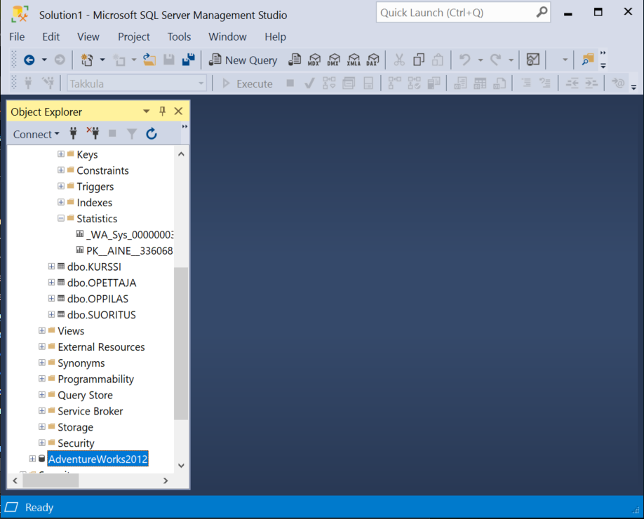
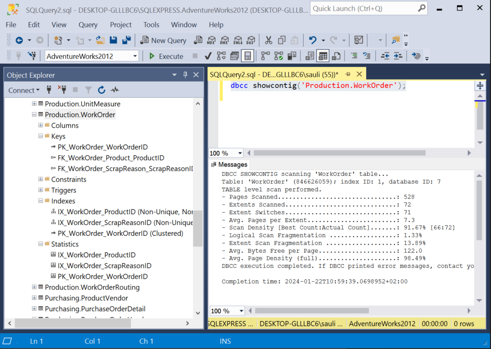

# Tehtävä 01:

- Lataa koneellesi Kurssin Teams ryhmästä löytyvä AdventureWorks2012_Data.mdf tietokanta tiedosto. Siirrä se SQL Server:isi Data -kansioon, eli
C:\Program Files\Microsoft SQL Server\MSSQL16.SQLEXPRESS\MSSQL\DATA
tai jokin vastaava SQL Server versiosta riippuen. Tarvitset Administrator tunnukset - jotka sinulla on omalla koneellasi olevaan SQL Server:iin. 

 
Kuva 1. AdventureWorks2012_Data.mdf tietokanta. 

- Attach:aa eli liitä se ajettavaksi tietokannaksi SQL Server palvelimeesi Microsoft SQL Server Management Studiolla (SSMS). Klikkaa hiiresi oikealla korvalla Databases objektia SSMS:n Object Explorer:issa. 
- Klikkaa sen jälkeen Add -painonappulaa.
- Ja valitse AdventureWorks2012_Data.mdf alla olevan kuvan mukaisesti:  

 
Kuva 2. AdventureWorks2012_Data.mdf liittäminen tietokantapalvelimeen. 

- Remove:a tietokannalle ehdotettu transaktioloki tiedosto pois. Sitä ei ole toimitettu. Tietokanta saadaan liitettyä ilman sitä.  

 
Kuva 3. AdventureWorks2012_Data.mdf lokitiedostoehdotuksen poisto. 

- Nyt tietokanta on tietokantapalvelimessasi,

 

 
Kuva 4. AdventureWorks2012_Data.mdf tietokantapalvelimellasi. 

- Tämän tietokannan taulun eheyden tarkistamisen voi tehdä Microsoft SQL Server:issä komennolla:
 
<code>
dbcc showcontig('TAULUNIMI');
</code>
 

 
Kuva 5. AdventureWorks2012_Data.mdf tietokannan erään taulun statistiikka tiedot. 

Palauta tämän jälkeen Moodleen, palautuslinkkiin  T-SQL kielinen scripti (Transact-SQL), jolla saat selville jonkin AdventureWorks2012_Data tietokannan taulun ...
