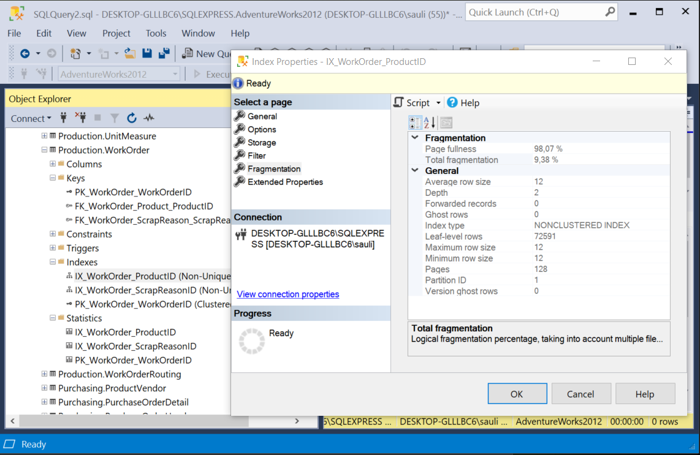

# Tehtävä 02:


Kahden eri transaktion (esim. kahden eri käyttäjän tai ikkunan) kilpailutilanne samasta datarivistä tietokannassa.

- Tee seuraavanlainen tehtävä SQL Server:in Management Studiossa.
- Tee Pankki niminen tietokanta.
- Luo sinne tietokanta taulu, jonka nimi on tilit: 
```sql
create table tilit
    (tiliNro int primary key,
    summa money
);
```
- Lisää sen jälkeen tilit tauluun muutama tili tieto tilinumerolle 1001001 ja 1001002:
```sql
insert into tilit (tiliNro, summa) VALUES (1001001,700);
insert into tilit (tiliNro, summa) VALUES (1001002,500.5);

-- Varmistu, että rivien lisäämenen tauluun onnistui:
select * from tilit;
´
-- Tuloksena pitäisi tulla vastaus:
tiliNro summa
1001001	700,00
1001002	500,50
```


- Seuraavaksi tehtävä jatkuu siten, että käynnistä uusi Query Window tai mieluummin toinen SSMS-sovellus ja kirjaudu sisään, Tehdään kaksi rinnakkaista istuntoa. Olkoot Ikkuna 1 se, missä teit edelliset komennot ja Ikkuna 2 uusi SSMS instanssi.

- Ikkunassa 1 on jo todettu, että taulun tilit kaksi datariviä näkyvät niin kuin pitääkin.

- Nyt siirrytään Ikkunaan 2.
- Ja siellä aloitetaan transaktio Transact SQL:n eli T-SQL:n komennolla begin transaction. Tällainen transaktio lopetetaan joko komennolla commit tai rollback, jos halutaan peruuttaa transaktio. 
- Aja Ikkuna 2:ssa seuraavat lauseet. Kyseessä on tilisiirto tai maksu pankin järjestelmissä. Nyt käytämme sitä mahdollisimman selkeänä esimerkkinä aloitetusta transaktiosta, ja mitä vaikutuksia sillä on.

```sql
begin transaction
update tilit set summa = summa - 20 where tiliNro=1001001;
update tilit set summa = summa + 20 where tiliNro=1001002;

select * from tilit;
```

- Siirry takaisin Ikkuna 1:een
```sql
select * from tilit;
```

- Kerro omin sanoin tämän tehtävän vastauksessasi Moodleen, mitä tässä kohtaa tapahtuu. Miksi Ikkuna 1:een ei tule tulosta, mutta Ikkuna 2:een tulee?

- Siirry nyt seuraavaksi takaisin Ikkuna 2:een ja aja siellä commit lause, lopettaaksesi kesken eräisen transaktion siellä

```sql
commit;
```

- Kerro lopuksi vastauksessasi Moodleen, miksi nyt Ikkuna 1 saa tuloksen pitkän odottelun jälkeen.

- Mitä merkitystä tällä on tietokanta palvelimen ylläpidon kannalta? Mitkä ovat seuraukset, jos jossa sovelluksessa on tämän kaltaisesti virheellisesti toimivat transaktio? Miksi tällaisen tilisiirron tai maksu tekemiseen on käytettävä transaktioita, kuten Ikkuna 2:ssa on tehty. Mitkä olisivat seuraukset, jollei käytettäisi?

Palauta tämän jälkeen Moodleen selitys tai kuvaus kilpailutilanteesta.  


<!-- 
- Tutki AdventureWorks2012_Data tietokannan, jonkin taulun indeksien frakmentoitumisastetta. Mikä on Microsoftin maksimi suositus frakmentoitumisasteelle.

- Valitse haluamasi taulun jokin indeksi hiiren oikealla korvalla napauttaena. Valitse Properties. Siirry Fragmentation sivulle alla olevan kuvan mukaisesti:
<br>

<br>
Kuva 1. AdventureWorks2012_Data.mdf erään taulun frakmentoitumisasteen tutkimista.<br>

- Milloin tietokannan indeksit kannattaa reorganisoida ja milloin rebuild:ata.
- Miksi näin kannattaa tehdä?
- Mitkä voivat olla ne seuraukset, jollei näin tee?

Palauta Moodleen, palautuslinkkiin  vastauksesi. -->
