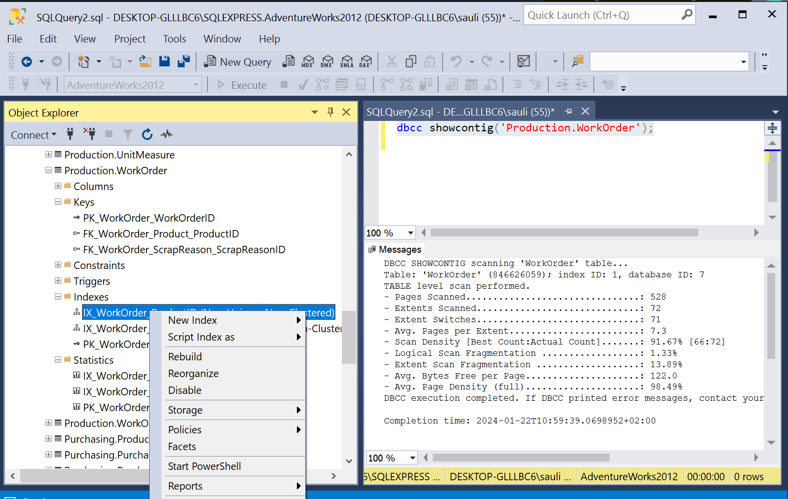

# Tehtävä 03:

- Valitse haluamasi taulun jokin indeksi hiiren oikealla korvalla napauttaena. Valitse Reorganize. Tutki tämän jälkeen, mitä vaikutuksia operaatiolla oli. 

 

 
Kuva 1. AdventureWorks2012_Data.mdf erään taulun indeksin reorganisointi ja rebuld:aus. 

- Oliko kyseiselle indeksille tarpeen tehdä reorganisointia?
- Tarvitsiko tehdä tälle indeksieel Rebuild:austa.
- Tee kaikesta huolimatta myös harjoituksen vuoksi Rrbuild kyseiselle indeksille.
- Millaiset olivat Rebuild:auksen vaikutukset kyseisen indeksin frakmentoitumisasteeseen?

Palauta Moodleen, palautuslinkkiin  vastauksesi.
