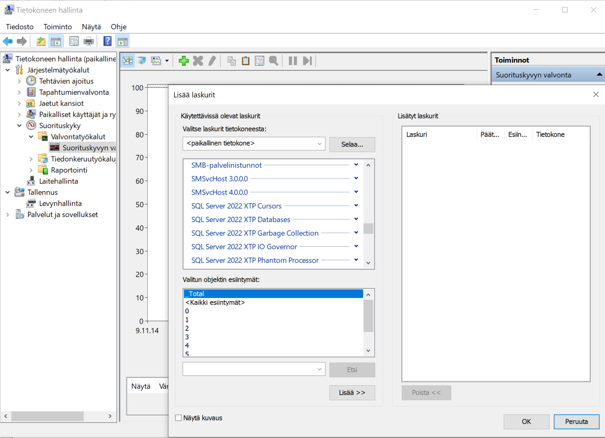

# Tehtävä 02:

- Tutustu Windows Performance Monitor:iin eli suomeksi Suorituskyvyn valvonta.

- Windows 10:ssa esimerkiksi, löydät Performance Monitor:in valitsemalla:
- Hiiren oikealla Computer Management eli Tietokoneen hallinta
- Avaa Performance eli Suorituskyky
- Ja valitse Performance Monitor eli Suorituskyvyn valvonta
- Tutustu millaisia kaikenlaisia laskureita löytyy SQL Server:ille. Niitä pääsee tarkastelemaan klikkaamalla + painonappulaa, alla olevan kuvan mukaisesesti: 

 
Kuva 1. Windows 10 Performance Monitor Counters. 

- Löytyykö seuraavanlaiset laskurit?
- Suositeltavat laskurit, joita kannattaa seurata ylläpidon säännöllisesti ovat:
    - SQL Server Databases: Transactions/sec
- Millaisia tuloksia saat?
- [Tutustu sitä esittelevään sivuun Microsoft:illa](https://learn.microsoft.com/en-us/sql/relational-databases/performance-monitor/sql-server-databases-object?view=sql-server-ver16)
- Tutustu myös 
    - Sql Server Buffer Manager -> Buffer Cache Hit Ratio:oon
- Millaisia tuloksia saat koneellasi?
- Millaisia ohjeita Microsoft antaa tästä laskurista?

Palauta tämän jälkeen Moodleen, palautuslinkkiin vastaukseksesi.
